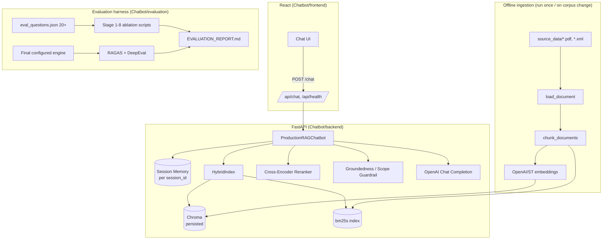

# Design Document

## Overview

The system has two halves that share a config-driven RAG core:

1. **Production app** — React frontend talking to a FastAPI backend, which wraps a `ProductionRAGChatbot` engine (ingestion → chunking → hybrid retrieval → rerank → guardrail → grounded generation → citations → memory).
2. **Evaluation harness** — standalone scripts/notebooks that exercise the same engine's building blocks in isolation, one per ablation stage, against a labeled 20+ question set, writing results into `EVALUATION_REPORT.md`.

The engine's tunables (chunk size, embedding model, retrieval mode, fusion method, reranker on/off, LLM) live in one `Settings` object. The evaluation harness's job is to determine the values of that object; the production app just consumes it. This keeps the ablation work from being disconnected "notebook homework" — it directly configures the shipped app.

Everything lives under `Chatbot/`, sitting alongside the existing `../notebooks/` (teaching material + reference scaffold) and `../source_data/` (the 5 real documents), per the chosen "everything inside Chatbot/" layout.

## Architecture



## Directory Structure

```
Chatbot/
├── .kiro/specs/wells-fargo-rag-chatbot/   # this spec
├── README.md                              # setup + run instructions (Req 15.3)
├── .env.example                           # OPENAI_API_KEY, etc.
├── EVALUATION_REPORT.md                   # Req 10, 11 deliverable (filled by evaluation/)
├── ACCEPTANCE_TESTS.md                    # Req 12 transcripts/results
├── PRESENTATION.md                        # Req 16: slide-equivalent summary of findings for the live walkthrough
├── backend/
│   ├── requirements.txt
│   ├── app/
│   │   ├── main.py                        # FastAPI app, CORS, routers
│   │   ├── config.py                      # Settings (pydantic-settings) — the one place ablation winners land
│   │   ├── api/
│   │   │   ├── chat.py                    # POST /chat
│   │   │   └── health.py                  # GET /health
│   │   ├── ingestion/
│   │   │   ├── loaders.py                 # load_document(): PDF (pypdf/pdfplumber/PyMuPDF swappable), XBRL XML
│   │   │   └── chunking.py                # chunk_documents(): strategy + size/overlap from Settings
│   │   ├── retrieval/
│   │   │   ├── vector_store.py            # Chroma PersistentClient wrapper
│   │   │   ├── sparse.py                  # bm25s wrapper
│   │   │   └── hybrid.py                  # HybridIndex: RRF + weighted-alpha fusion
│   │   ├── generation/
│   │   │   ├── reranker.py                # cross-encoder reranker, toggle via Settings
│   │   │   ├── prompt.py                  # grounded system prompt + citation format
│   │   │   ├── guardrails.py              # min-rerank-score refusal, out-of-scope, account-data refusal
│   │   │   └── chatbot.py                 # ProductionRAGChatbot: orchestrates the above
│   │   └── memory/
│   │       └── session_store.py           # per-session history + condense-question rewrite
│   └── tests/
│       └── test_chatbot.py
├── frontend/                              # Vite + React
│   ├── package.json
│   └── src/
│       ├── main.jsx / App.jsx
│       ├── api/chatApi.js                 # axios POST /chat
│       └── components/
│           ├── ChatWindow.jsx
│           ├── MessageBubble.jsx
│           ├── CitationList.jsx
│           └── ChatInput.jsx
├── data/
│   └── vector_store/                      # Chroma persisted DB (gitignored)
└── evaluation/
    ├── eval_questions.json                # Req 9: 20+ labeled questions
    ├── run_stage1_parsing.py
    ├── run_stage2_chunking.py
    ├── run_stage3_embeddings.py
    ├── run_stage4_vector_db.py
    ├── run_stage5_retrieval_mode.py
    ├── run_stage6_hybrid_merge.py
    ├── run_stage7_reranking.py
    ├── run_stage8_llm.py
    ├── run_end_to_end_ragas_deepeval.py
    └── metrics.py                         # shared R@1/R@3/R@10/MRR@10/NDCG@3 + numeric_fact_accuracy
```

## Components and Interfaces

### Ingestion (`backend/app/ingestion/`)
- `load_document(path) -> list[Document]`: dispatches on extension. PDFs use a swappable parser (`PARSER` setting: `pypdf` / `pdfplumber` / `pymupdf`) so `evaluation/run_stage1_parsing.py` can call it 3 ways over the same files and diff clean-text %. Each `Document` carries `metadata = {"source": filename, "page": n}`.
- XBRL handling: parse `WellsFargo_Financial_Labels_XBRL.xml` first into a `{concept_id: human_label}` map (via `xml.etree.ElementTree`, matching on the `label:label` linkbase elements), then walk `WellsFargo_Financial_Data_XBRL.xml` facts and emit one synthetic sentence `Document` per reported fact: `"{human_label} was {value} for {context/period}."`, with `metadata = {"source": "WellsFargo_Financial_Data_XBRL.xml", "page": concept_id}`. This directly answers the XBRL seed question in `REQUIREMENT.md` §7 ("What's Wells Fargo's reported revenue...") and satisfies Requirement 1.2.
- `chunk_documents(documents, strategy, size, overlap) -> list[Chunk]`: default recursive/sentence-aware splitter (`RecursiveCharacterTextSplitter`, notebook 02's "sane default"), parameterized so `evaluation/run_stage2_chunking.py` can sweep strategy/size/overlap. Chunk metadata always inherits `source`/`page`.

### Retrieval (`backend/app/retrieval/`)
- `VectorStore`: thin wrapper over `chromadb.PersistentClient(path="Chatbot/data/vector_store")`, one collection per (chunking config, embedding model) pair so ablation runs don't clobber each other. Embedding function is Settings-driven (OpenAI `text-embedding-3-small` default, swappable to a `sentence-transformers` model for Stage 3).
- `SparseIndex`: `bm25s` index built from the same chunk text, persisted alongside.
- `HybridIndex` (ported from notebook 13): given a query, retrieves from both, fuses via RRF (`score = Σ 1/(k+rank)`, k=60 default) or weighted linear combination (`α·dense_norm + (1-α)·sparse_norm`), both selectable via `Settings.FUSION_METHOD` / `Settings.FUSION_ALPHA`. Returns ranked `(chunk, score)` pairs with source metadata intact — this is what Requirement 4 and Stage 5/6 ablations exercise directly.

### Reranking (`backend/app/generation/reranker.py`)
- `Reranker` (ported from notebook 13): cross-encoder (`cross-encoder/ms-marco-MiniLM-L-6-v2`) rescoring of the top-20 hybrid results down to top-N. Enabled/disabled via `Settings.RERANK_ENABLED`. Exposes the same interface whether enabled or not (identity passthrough when off) so the chatbot orchestration code doesn't branch on it.

### Guardrails (`backend/app/generation/guardrails.py`)
- Groundedness: if the top (reranked or retrieved) chunk's score is below `Settings.MIN_RERANK_SCORE`, short-circuit to a canned "I don't have enough information in the provided documents" response — never reaches the LLM. Mirrors notebook 13's `MIN_RERANK_SCORE` guardrail.
- Out-of-scope: a lightweight check (keyword match against a configurable competitor-bank list, escalating to an LLM classification only if ambiguous) that returns a canned out-of-scope refusal without calling retrieval at all.
- Account-data requests: keyword/pattern check for "my balance", "my account", "my card number" etc., returning a canned "I can only answer general policy questions" response.

### Generation (`backend/app/generation/{prompt.py,chatbot.py}`)
- System prompt (extends notebook 01/13's grounded-answer convention): forbids outside knowledge, requires numbered `[1][2]` citations, instructs the refusal phrasing when context is insufficient.
- `ProductionRAGChatbot.answer(session_id, message) -> {answer, citations}`: orchestrates guardrails → memory-aware query rewrite → hybrid retrieve → rerank → prompt assembly → LLM call (`Settings.LLM_MODEL`, swappable for Stage 8) → citation extraction mapping `[n]` back to `{document, page}` → memory update. This is the single entry point the FastAPI layer calls.

### Memory (`backend/app/memory/session_store.py`)
- Per-`session_id` in-memory (or SQLite-backed, reusing the `SqliteSaver` pattern from notebook 11 / `production_rag_chatbot_memory/rag_agent_pipeline.py`) turn history. A condense-question step rewrites follow-ups ("what about that fee?") into standalone queries before retrieval, per notebook 13's pattern. History is trimmed/summarized past a token budget (Requirement 8.3) — reuse notebook 11's `SummarizationMiddleware` idea, kept simple (e.g. truncate to last N turns) since this is not the graded focus.

### Backend API (`backend/app/api/`)
- `POST /chat` — body `{session_id: str, message: str}`, response `{answer: str, citations: [{document: str, page: str|int}], refused: bool}`. Calls `ProductionRAGChatbot.answer`.
- `GET /health` — returns `{status: "ok"}`, used by the frontend and for smoke-testing deployment.
- CORS restricted to the Vite dev server origin (`http://localhost:5173`).

### Frontend (`frontend/src/`)
- `ChatWindow` holds message list + input; generates/persists a `session_id` (UUID) in `localStorage` on first load (Requirement 13.3).
- `MessageBubble` renders answer text with inline `[n]` markers; `CitationList` renders the resolved `{document, page}` list below each bot message (Requirement 13.2).
- `chatApi.js` wraps `axios.post('/chat', {session_id, message})`, surfaces network/timeout errors to the UI (Requirement 13.4).

### Evaluation harness (`evaluation/`)
- `eval_questions.json`: 20+ entries `{id, question, query_type: "keyword"|"semantic", ground_truth_source, ground_truth_page, ideal_answer}`, expanded from the 7 seed questions in `REQUIREMENT.md` §7 by writing 2-3 more per document plus a few personal-data/out-of-scope negative controls reused from the acceptance tests.
- `metrics.py`: shared `recall_at_k` (called with k=1, 3, and 10 — the tutor's email calls out Recall@10 explicitly in addition to the R@1/R@3/MRR@10/NDCG@3 set already in `EVALUATION_METHODOLOGY.md`), `mrr_at_10`, `ndcg_at_3` per the exact formulas in `EVALUATION_METHODOLOGY.md` Part A, plus `numeric_fact_accuracy(answer, ground_truth_chunk)` — a domain-specific custom metric (Requirement 10.6) that regex-extracts dollar amounts/percentages from a generated answer and checks each one appears verbatim in the cited source chunk, flagging any invented or altered number. Written once, imported by every `run_stageN_*.py` so all stages measure identically.
- One script per ablation stage (1-8), each: holds every other stage's config at its current best-known value, varies only the stage under test, runs `eval_questions.json` through it, and appends a filled markdown table to `EVALUATION_REPORT.md` (not a placeholder — Requirement 10.2 is explicit that empty tables score zero).
- Stage 4 (`run_stage4_vector_db.py`) and Stage 8 (`run_stage8_llm.py`) additionally append a short written **Scalability** paragraph beside their Latency/Cost numbers (Requirement 10.5) — e.g. how Chroma's single-node local index and BM25's in-memory rebuild would need to change if the corpus grew from 60 pages to a full bank-wide document set, and how per-query LLM cost/throughput scales with concurrent users. This is written analysis, not a measured column, since the actual corpus is too small to benchmark scale empirically.
- `run_end_to_end_ragas_deepeval.py`: after all 8 stages have picked winners and `backend/app/config.py` is updated to match, runs the full question set through the *actual* `ProductionRAGChatbot` (same code path as production) and computes RAGAS + DeepEval scores plus `numeric_fact_accuracy` (Requirement 11, 10.6), reusing patterns from notebooks 09/10 and `production_rag_chatbot_memory/eval_pipeline.py`.
- `PRESENTATION.md`: written last, after `EVALUATION_REPORT.md` is complete. Summarizes — without re-deriving — the architecture and the winning answer to each of the tutor's 6 named decisions (parsing, chunking, retrieval methodology incl. fusion/α/reranking, embeddings incl. model+dimensionality, vector DB, LLM), each with its one or two headline numbers, plus the end-to-end RAGAS/DeepEval scores (Requirement 16).

## Data Models

```python
# backend/app/ingestion/loaders.py
class Document:
    text: str
    metadata: dict  # {"source": str, "page": int | str}

# backend/app/retrieval/hybrid.py
class RetrievedChunk:
    text: str
    source: str
    page: int | str
    score: float
    rank: int

# backend/app/api/chat.py (pydantic)
class ChatRequest:
    session_id: str
    message: str

class Citation:
    document: str
    page: int | str

class ChatResponse:
    answer: str
    citations: list[Citation]
    refused: bool
```

## Configuration (`backend/app/config.py`)

Single `Settings` (pydantic-settings, loaded from `.env`) holding every ablation-tunable value with a sensible default, e.g.:

```python
class Settings(BaseSettings):
    openai_api_key: str
    parser: Literal["pypdf", "pdfplumber", "pymupdf"] = "pymupdf"
    chunk_strategy: Literal["fixed", "recursive", "semantic"] = "recursive"
    chunk_size: int = 500
    chunk_overlap: int = 50
    embedding_model: str = "text-embedding-3-small"
    vector_db: Literal["chroma", "faiss"] = "chroma"
    retrieval_mode: Literal["dense", "sparse", "hybrid"] = "hybrid"
    fusion_method: Literal["rrf", "weighted"] = "rrf"
    fusion_alpha: float = 0.5
    rerank_enabled: bool = True
    min_rerank_score: float = -9.5
    llm_model: str = "gpt-4o-mini"
```

Defaults above are placeholders matching the notebook 13 scaffold; Requirement 10.3/2.3/4.3/6.4/5.3 require these to be overwritten with the actual ablation winners once `evaluation/` has run.

## Error Handling
- Ingestion: a page/fact that fails to parse is logged and skipped, not fatal — surfaces in Stage 1's clean-text % metric rather than crashing the pipeline.
- Retrieval/LLM: `POST /chat` catches OpenAI API errors/timeouts and returns HTTP 502 with a generic message (Requirement 14.4); the frontend renders this as a chat-visible error bubble (Requirement 13.4), never a silent hang.
- Guardrails run *before* any LLM call for out-of-scope/account-data cases, and *after* retrieval but *before* generation for the groundedness check — so refusals never depend on the LLM behaving itself, they're enforced in code.

## Correctness Properties

These are invariants the implementation must hold regardless of which ablation winners end up in `Settings` — they're what "correct" means for this system, independent of which specific model/DB/parser is chosen:

### Property 1: No answer without evidence
`ProductionRAGChatbot.answer()` must never call the LLM's generation prompt with zero retrieved chunks, and must never emit an answer whose claims aren't traceable to at least one retrieved chunk. Enforced by the groundedness guardrail running strictly before the generation call.

**Validates: Requirements 7.1**

### Property 2: Every citation resolves
Every `[n]` marker in a generated answer must have a corresponding entry in the returned `citations` list with a real `{document, page}` pulled from that chunk's metadata — never a dangling or fabricated citation number.

**Validates: Requirements 6.2**

### Property 3: Numeric fidelity
Any dollar amount, percentage, or APR figure appearing in a generated answer must exactly match a value present in its cited source chunk — this is what `numeric_fact_accuracy` checks, and it must hold at the acceptance-test level even if the ablation-winning LLM's prose otherwise paraphrases freely.

**Validates: Requirements 10.6, 7.4**

### Property 4: Scope refusals are guardrail-enforced, not model-enforced
Out-of-scope (other banks) and account-data requests must be caught by the guardrail layer before retrieval/generation runs, so they behave identically regardless of which LLM Stage 8 picks.

**Validates: Requirements 7.2, 7.3**

### Property 5: Ablation config changes never require code changes
Every value swept in Phases 5-6 of `tasks.md` (parser, chunk size/strategy, embedding model, vector DB, retrieval mode, fusion method/α, reranker on/off, LLM) is read from `Settings`, so switching the production default to a new winner is a config edit, never a code edit, in `backend/app/{ingestion,retrieval,generation}/*.py`.

**Validates: Requirements 15.2, 2.3, 3.2, 4.3, 5.3, 6.4**

### Property 6: Session isolation
Two different `session_id`s must never see each other's conversation history — memory lookups are always keyed by `session_id`, never global state.

**Validates: Requirements 8.2**

## Testing Strategy
- `backend/tests/test_chatbot.py`: unit-level checks that the 5 acceptance-test questions (Requirement 12) route to the expected guardrail path (grounded-answer vs. out-of-scope vs. account-data) using mocked retrieval where useful.
- `evaluation/` scripts double as the testing strategy for retrieval quality — there is no separate "test suite" for R@1/R@3/etc., the ablation scripts *are* the tests, and their output *is* the evidence required by Requirement 10.
- Manual acceptance run: start backend + frontend, ask all 5 official questions through the real UI, capture transcripts into `ACCEPTANCE_TESTS.md` (Requirement 12.3).
