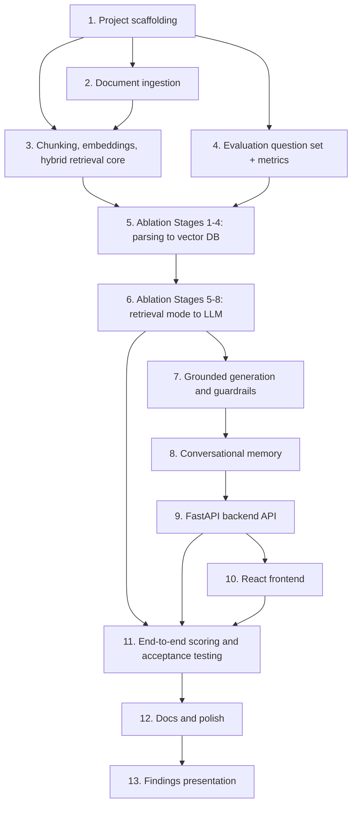

# Implementation Plan

## Overview

This plan builds the Wells Fargo RAG chatbot and its evaluation harness together, in an order that respects one constraint: the ablation experiments (Phases 4-6) determine the production pipeline's configuration, so they must run *before* `backend/app/config.py`'s defaults are finalized. Phases 1-3 build every pipeline component in a config-driven way (nothing hardcoded), Phases 4-6 prove out which config values win using real measurements, and Phases 7-13 wire the finalized config into a working, guardrailed, cited, memory-enabled app plus the documentation and presentation the tutor's email requires.

## Task Dependency Graph



Phase 2 (ingestion) and Phase 4 (question set + metrics) can be worked in parallel — both only depend on Phase 1's scaffolding, not on each other. Phase 5 is the first sync point: it needs Phase 3's retrieval components *and* Phase 4's question set/metrics both complete. Phase 11 needs Phase 6's finalized config *and* Phase 9/10's working app, since it evaluates the real, deployed pipeline, not a script in isolation. Everything from Phase 6 onward is strictly sequential — each phase consumes the previous phase's output directly.

```json
{
  "waves": [
    {"wave": 1, "tasks": [1], "note": "Scaffolding — everything else depends on this"},
    {"wave": 2, "tasks": [2, 4], "note": "Ingestion and the eval question set/metrics are independent of each other"},
    {"wave": 3, "tasks": [3], "note": "Chunking/retrieval/reranker core needs ingestion (2) done"},
    {"wave": 4, "tasks": [5], "note": "Ablation Stages 1-4 need both the retrieval core (3) and the eval set/metrics (4)"},
    {"wave": 5, "tasks": [6], "note": "Ablation Stages 5-8 need Stage 1-4 winners locked in first"},
    {"wave": 6, "tasks": [7], "note": "Generation/guardrails use the now-finalized Settings from wave 5"},
    {"wave": 7, "tasks": [8], "note": "Memory wraps the chatbot built in wave 6"},
    {"wave": 8, "tasks": [9], "note": "Backend API exposes the memory-enabled chatbot"},
    {"wave": 9, "tasks": [10], "note": "Frontend consumes the backend API"},
    {"wave": 10, "tasks": [11], "note": "End-to-end scoring and acceptance testing need the full deployed app (9, 10) and the final config (6)"},
    {"wave": 11, "tasks": [12], "note": "Docs finalize once all measured results exist"},
    {"wave": 12, "tasks": [13], "note": "Presentation summarizes the completed report and docs"}
  ]
}
```

## Tasks

- [ ] 1. Project scaffolding
  - [ ] 1.1 Create `backend/` (FastAPI project) and `frontend/` (Vite + React) skeletons under `Chatbot/`
  - [ ] 1.2 Write `backend/requirements.txt` (fastapi, uvicorn, langchain, langchain-openai, chromadb, bm25s, sentence-transformers, cross-encoder deps, pypdf, pdfplumber, pymupdf, pymupdf4llm, ragas, deepeval, pydantic-settings), seeding from `../../notebooks/requirements.txt` and `../../notebooks/production_rag_chatbot_memory/requirements.txt`
  - [ ] 1.3 Write `.env.example` (`OPENAI_API_KEY=`) and `.gitignore` (`.env`, `data/vector_store/`, `__pycache__/`, `node_modules/`)
  - [ ] 1.4 Implement `backend/app/config.py` `Settings` class per design.md, loaded from `.env`
  - _Requirements: 15.1, 15.2_

- [ ] 2. Document ingestion
  - [ ] 2.1 Implement `backend/app/ingestion/loaders.py::load_document()` for PDFs with a swappable parser (`pypdf` / `pdfplumber` / `pymupdf` behind `Settings.parser`), preserving `source`/`page` metadata — adapt from `../../notebooks/02_ingestion_and_chunking_langchain.ipynb`
  - [ ] 2.2 Implement XBRL ingestion: parse `WellsFargo_Financial_Labels_XBRL.xml` into a concept→label map, then walk `WellsFargo_Financial_Data_XBRL.xml` facts into synthetic fact-sentence `Document`s
  - [ ] 2.3 Log (not crash on) pages/facts that fail to parse
  - _Requirements: 1.1, 1.2, 1.3, 1.4_

- [ ] 3. Chunking, embeddings, and hybrid retrieval core
  - [ ] 3.1 Implement `backend/app/ingestion/chunking.py::chunk_documents()` — recursive/sentence-aware default, size/overlap/strategy from `Settings`, adapted from notebook 13's `chunk_documents`
  - [ ] 3.2 Implement `backend/app/retrieval/vector_store.py` — Chroma `PersistentClient` wrapper, embedding model from `Settings.embedding_model`, one collection keyed by (chunk config, embedding model)
  - [ ] 3.3 Implement `backend/app/retrieval/sparse.py` — `bm25s` index over the same chunk text
  - [ ] 3.4 Implement `backend/app/retrieval/hybrid.py::HybridIndex` — RRF and weighted-α fusion, both selectable, ported from notebook 13
  - [ ] 3.5 Implement `backend/app/generation/reranker.py::Reranker` (cross-encoder, toggle via `Settings.rerank_enabled`), ported from notebook 13
  - _Requirements: 2.1, 2.2, 3.1, 3.2, 3.3, 4.1, 4.2, 4.4, 5.1, 5.2_

- [ ] 4. Evaluation question set and shared metrics
  - [ ] 4.1 Create `evaluation/eval_questions.json` with 20+ entries (`question`, `query_type`, `ground_truth_source`, `ground_truth_page`, `ideal_answer`), expanding the 7 seed questions in `../../REQUIREMENT.md` §7 across all 3 PDFs + XBRL, tagged keyword vs. semantic
  - [ ] 4.2 Implement `evaluation/metrics.py` — `recall_at_k` (k=1, 3, and **10** — the tutor's email explicitly calls out Recall@10 in addition to the methodology's R@1/R@3), `mrr_at_10`, `ndcg_at_3`, exactly per `../../EVALUATION_METHODOLOGY.md` Part A formulas
  - [ ] 4.3 Implement `evaluation/metrics.py::numeric_fact_accuracy(answer, ground_truth_chunk)` — the custom banking-specific metric: regex-extract dollar amounts/percentages/APRs from a generated answer and verify each appears verbatim in the cited source chunk
  - _Requirements: 9.1, 9.2, 9.3, 10.6_

- [ ] 5. Ablation Stages 1-4 (parsing → vector DB)
  - [ ] 5.1 `evaluation/run_stage1_parsing.py` — run `load_document` with each of `pypdf`/`pdfplumber`/`pymupdf`, report clean-text % and downstream R@3; fill the Stage 1 table in `EVALUATION_REPORT.md`
  - [ ] 5.2 `evaluation/run_stage2_chunking.py` — sweep chunk strategy × size × overlap (per methodology's suggested 300/500/800 tokens, 0/50/100 overlap), report R@1/R@3/R@10/MRR@10/NDCG@3; fill Stage 2 table
  - [ ] 5.3 `evaluation/run_stage3_embeddings.py` — compare ≥2 embedding models, report vector dimensionality, R@1/R@3/R@10/MRR@10/NDCG@3/latency; fill Stage 3 table (dimensionality matters because the tutor explicitly asks "which model, vector size, and why")
  - [ ] 5.4 `evaluation/run_stage4_vector_db.py` — compare Chroma vs. FAISS on R@3/R@10 parity, index build time, metadata filtering, persistence, **plus a written scalability paragraph** (how each would behave if the corpus grew from 60 pages to a full document set); fill Stage 4 table
  - _Requirements: 10.1, 10.2, 10.5_

- [ ] 6. Ablation Stages 5-8 (retrieval mode → LLM)
  - [ ] 6.1 `evaluation/run_stage5_retrieval_mode.py` — dense vs. sparse vs. hybrid, broken out by `query_type`; fill Stage 5 table
  - [ ] 6.2 `evaluation/run_stage6_hybrid_merge.py` — RRF vs. weighted-α (sweep ≥3 α values); fill Stage 6 table and state the winning weight in writing
  - [ ] 6.3 `evaluation/run_stage7_reranking.py` — no reranker vs. cross-encoder rerank, report accuracy delta and added latency; fill Stage 7 table
  - [ ] 6.4 `evaluation/run_stage8_llm.py` — ≥2 LLMs with retrieval fixed, report RAGAS + DeepEval + `numeric_fact_accuracy` + cost/latency, **plus a written scalability paragraph** (throughput/cost under concurrent users); fill Stage 8 table
  - [ ] 6.5 Update `backend/app/config.py` `Settings` defaults to the winning values from Stages 1-8
  - [ ] 6.6 Write the synthesis paragraph and "what we'd try next" section in `EVALUATION_REPORT.md`
  - _Requirements: 10.1, 10.2, 10.3, 10.4, 10.5, 10.6, 2.3, 3.2, 4.3, 5.3, 6.4_

- [ ] 7. Grounded generation and guardrails
  - [ ] 7.1 Implement `backend/app/generation/prompt.py` — grounded system prompt forbidding outside knowledge, requiring `[n]` citations, adapted from `../../notebooks/01_why_rag_the_case_for_retrieval.ipynb` convention
  - [ ] 7.2 Implement `backend/app/generation/guardrails.py` — groundedness threshold refusal (`min_rerank_score`), out-of-scope competitor-bank refusal, account-data-request refusal
  - [ ] 7.3 Implement `backend/app/generation/chatbot.py::ProductionRAGChatbot` — orchestrates guardrails → retrieval → rerank → prompt → LLM call → citation mapping, using the now-finalized `Settings`
  - _Requirements: 6.1, 6.2, 6.3, 7.1, 7.2, 7.3, 7.4_

- [ ] 8. Conversational memory
  - [ ] 8.1 Implement `backend/app/memory/session_store.py` — per-`session_id` history store, condense-question rewrite for follow-ups, history trimming past a token budget
  - [ ] 8.2 Wire memory into `ProductionRAGChatbot.answer()`
  - _Requirements: 8.1, 8.2, 8.3_

- [ ] 9. FastAPI backend API
  - [ ] 9.1 Implement `backend/app/api/chat.py::POST /chat` and `backend/app/api/health.py::GET /health`
  - [ ] 9.2 Wire CORS for the Vite dev origin in `backend/app/main.py`
  - [ ] 9.3 Handle OpenAI errors/timeouts with a clean error response
  - [ ] 9.4 `backend/tests/test_chatbot.py` — verify the 5 acceptance questions route to the expected guardrail/answer path
  - _Requirements: 14.1, 14.2, 14.3, 14.4_

- [ ] 10. React frontend
  - [ ] 10.1 Scaffold `ChatWindow`, `MessageBubble`, `CitationList`, `ChatInput` components and `api/chatApi.js`
  - [ ] 10.2 Generate and persist `session_id` in `localStorage`
  - [ ] 10.3 Render citations (document + page) visibly alongside each answer
  - [ ] 10.4 Handle loading and error states from the backend
  - _Requirements: 13.1, 13.2, 13.3, 13.4_

- [ ] 11. End-to-end scoring and acceptance testing
  - [ ] 11.1 `evaluation/run_end_to_end_ragas_deepeval.py` — run the full question set through the real, now-finalized `ProductionRAGChatbot`, compute RAGAS + DeepEval scores + `numeric_fact_accuracy`, record as the headline number in `EVALUATION_REPORT.md`
  - [ ] 11.2 Manually run the 5 official acceptance questions from `../../REQUIREMENT.md` §6 through the live app; log question, full answer, citations, and pass/fail into `ACCEPTANCE_TESTS.md`
  - _Requirements: 11.1, 11.2, 11.3, 12.1, 12.2, 12.3_

- [ ] 12. Docs and polish
  - [ ] 12.1 Write `Chatbot/README.md` with backend + frontend setup/run instructions
  - [ ] 12.2 Final pass on `EVALUATION_REPORT.md` — confirm all 8 tables are filled with real numbers (no placeholders), Recall@10 and scalability paragraphs are present where required, and the synthesis paragraph cites them
  - _Requirements: 15.3_

- [ ] 13. Findings presentation
  - [ ] 13.1 Write `Chatbot/PRESENTATION.md` (slide-equivalent) summarizing the architecture and, for each of the tutor's 6 named decisions (parsing, chunking, retrieval methodology/fusion/α/reranking, embeddings/dimensionality, vector DB, LLM), the winning choice and its headline number
  - [ ] 13.2 Include the end-to-end RAGAS + DeepEval + numeric-fact-accuracy scores and the 5 acceptance-test outcomes as the closing summary slide/section
  - _Requirements: 16.1, 16.2, 16.3_

## Notes

- Every `run_stageN_*.py` script must produce a **filled** table with real measured numbers — an empty or placeholder table scores zero for that stage per `EVALUATION_METHODOLOGY.md` Part D, so no task in Phase 5/6 is "done" until its table in `EVALUATION_REPORT.md` has actual data.
- `backend/app/config.py`'s `Settings` defaults start as notebook-13-scaffold placeholders (task 1.4) and are **not final** until task 6.5 overwrites them with ablation winners — don't treat the initial defaults as the answer to any of the tutor's 6 justification questions.
- Phase 13's presentation is a summary layer only (Requirement 16.3) — it should never contain a number that isn't already in `EVALUATION_REPORT.md` or `ACCEPTANCE_TESTS.md`.
